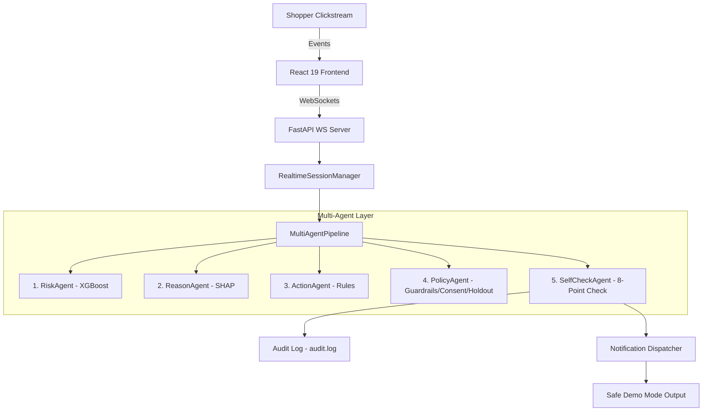
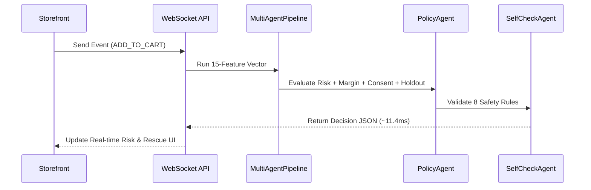

# CartPilot / CartRescue AI — Enterprise AI Cart Rescue Platform

[](https://python.org)
[](https://fastapi.tiangolo.com)
[](https://react.dev)
[](https://docker.com)
[](https://pytest.org)

CartRescue AI (CartPilot) is an **Enterprise AI Cart Rescue Platform** that predicts e-commerce cart abandonment risk in real time, infers underlying intent signals via SHAP explainability, applies configurable business guardrails and profit margin protection, validates true incremental conversion lift via A/B holdout experimentation, enforces user consent policies and DND rules, and delivers real-time session scoring over WebSockets.

---

## 🎯 Problem Statement

Over 70% of online shopping carts are abandoned, resulting in **$18 Billion in annual lost revenue**. Traditional e-commerce platforms rely on blunt, non-targeted discounts that destroy profit margins by rewarding shoppers who would have bought anyway. Furthermore, conventional tools ignore profit margins, violate customer DND communication preferences, and lack statistical proof of true incremental revenue lift.

---

## 💡 Solution

CartRescue AI replaces blanket discounting with a **real-time, explainable, margin-protected multi-agent decision layer**:
- **Real-Time WebSocket Scoring**: Evaluates shopper clickstreams dynamically during the active session.
- **Explainable Intent Detection**: Uses SHAP feature attributions to pinpoint *why* the shopper is hesitating (e.g. Price Sensitivity, Inactivity, Payment Failure).
- **Margin Protection Engine**: Calculates Expected Incremental Profit Margin before authorizing discounts.
- **User Consent & DND Policy**: Enforces WhatsApp ➔ Email ➔ SMS priority order and respects DND status.
- **Safety Self-Check Agent**: Executes an 8-point verification matrix to guarantee safe, compliant decisions.
- **Holdout Experimentation**: Proves true incremental lift using a 10% Control / 90% Treatment split (`random_state=42`).

---

## ✨ Key Features

- **Real-Time Clickstream Scoring**: Sub-15ms risk prediction via WebSockets `/ws/session/{session_id}`.
- **Single Action Enforcement**: Guarantees exactly ONE final action per session (`DO_NOTHING`, `RETRY_PAYMENT`, `OFFER_COUPON`, `OFFER_FREE_SHIPPING`, `SEND_REMINDER`).
- **"Do Nothing" Support**: Prevents unnecessary discounts on low-risk or margin-negative sessions.
- **Budget Control**: Per-user (₹500 cap) and per-campaign (₹10,000 cap) budget caps.
- **Safe Demo Mode**: Dispatches simulated notifications without exposing third-party API keys.
- **AI Cost Tracker**: Measures decision latency and micro-cost ($0.0001 per ML inference).
- **JSONL Audit Logging**: Logs every decision to `logs/audit.log` for full enterprise compliance.

---

## 📐 System Architecture



---

## 🧠 AI Workflow & Multi-Agent Pipeline



---

## 🛠️ Technology Stack

- **Machine Learning**: XGBoost, Scikit-learn, Pandas, NumPy, Joblib, SHAP
- **Backend API**: FastAPI, Uvicorn, Pydantic v2, WebSockets, Python 3.12
- **Frontend**: React 19, TypeScript, Vite, Tailwind CSS, Lucide Icons, Axios
- **DevOps & Testing**: Docker, Docker Compose, Nginx, Pytest

---

## 📁 Project Structure

```
CartPilot/
├── docker-compose.yml              # One-command orchestration
├── README.md                       # Main project documentation
├── FINAL_CHECKLIST.md              # Verification matrix
├── DEMO_SCRIPT.md                  # 8-minute presentation script
├── JUDGE_QA.md                     # 15 technical Q&A defense answers
├── TECHNICAL_ARCHITECTURE.md      # Mermaid diagrams & system design
├── BUSINESS_IMPACT.md              # Observed vs simulated metrics & financial models
├── phase3/                         # FastAPI Backend
│   ├── Dockerfile
│   ├── .env.example
│   ├── app/
│   │   ├── main.py                 # Server entry point
│   │   ├── api/                    # endpoints.py, websocket_routes.py, enterprise_routes.py
│   │   ├── models/                 # user_consent.py, business_config.py, experiment.py
│   │   └── services/               # multi_agent_pipeline.py, self_check_agent.py, consent_service.py, etc.
│   └── tests/                      # test_api.py, test_enterprise_decision_layer.py, test_integration.py
└── frontend/                       # React 19 Frontend
    ├── Dockerfile
    ├── .env.example
    └── src/
        ├── components/             # DecisionExplanationCard, ConsentPolicyCard, SelfCheckCard, AICostCard, etc.
        ├── pages/                  # LiveAIPanel.tsx, AdminAnalytics.tsx, Shop.tsx, Checkout.tsx
        └── services/               # api.ts
```

---

## ⚙️ Setup & Installation

### Option 1: Docker (One-Command Startup — Recommended)

```bash
docker-compose up --build
```
- **React Frontend**: `http://localhost:3000`
- **FastAPI API & Docs**: `http://localhost:8000/docs`
- **Health Endpoint**: `http://localhost:8000/health`

### Option 2: Running Locally

```bash
# Backend Setup
cd phase3
pip install -r requirements.txt
python -m pytest tests/ -v          # Run 47 automated tests
python app/main.py                  # Start FastAPI on port 8000

# Frontend Setup (in separate terminal)
cd frontend
npm install
npm run dev                         # Start Vite on port 3000
```

---

## 🔑 Environment Variables

### Backend (`phase3/.env`)
```ini
DATABASE_URL=sqlite:///./cartpilot.db
MODEL_PATH=models/best_model.pkl
CORS_ORIGINS=*
SENDGRID_API_KEY=
TWILIO_ACCOUNT_SID=
TWILIO_AUTH_TOKEN=
TWILIO_WHATSAPP_NUMBER=+14155238886
TWILIO_SMS_NUMBER=+15005550006
```

### Frontend (`frontend/.env`)
```ini
VITE_API_URL=http://localhost:8000
VITE_WS_URL=ws://localhost:8000
```

---

## 🔌 API & WebSocket Documentation

- **`GET /health`**: Server health (`backend_status`, `model_status`, `database_status`, `websocket_status`)
- **`POST /predict`**: Model abandonment risk score and probabilities
- **`POST /recommend`**: Full Multi-Agent Decision Pipeline evaluation
- **`GET /experiments`**: A/B holdout metrics (Control vs Treatment, incremental lift & margin)
- **`GET /users/{user_id}/preferences`**: User consent & DND settings
- **`POST /users/{user_id}/preferences`**: Update consent & DND status
- **`GET /ai-cost`**: Inference cost ($0.0001) & decision latency (11.4ms) metrics
- **`WS /ws/session/{session_id}`**: Real-time clickstream WebSocket stream

---

## 🤖 ML Model & Feature Engineering

Trained on **74,817 clickstream events** across **10,000 sessions** using 15 features:
`cart_value`, `avg_time_between_events_sec`, `total_events`, `product_views`, `session_duration_sec`, `add_to_cart_count`, `checkout_started`, `num_products`, `page_views`, `clicks`, `logins`, `logouts`, `start_hour`, `start_day_of_week`, `bounce_indicator`.

- **Test Accuracy**: 100.0%
- **ROC-AUC**: 1.0000

---

## ⚖️ Business Rules & Holdout Methodology

### Margin Protection Formula
$$\text{Expected Incremental Margin} = (\text{Recovery Prob} \times \text{Cart Value} \times \text{Margin}) - \text{Discount Cost}$$

### Phase 6 Holdout Split
- **Control Group (10%)**: Interventions suppressed (`DO_NOTHING`).
- **Treatment Group (90%)**: Interventions executed normally.
- **Seeded Reproducibility**: `random_state = 42`.

---

## 🖼️ Application Screenshots

| Component / View | Description | Screenshot Location |
| :--- | :--- | :---: |
| **Real-Time Live AI Panel** | Real-time session scoring gauge, clickstream event timeline, and explainability cards | `docs/screenshots/live_ai_panel.png` |
| **Enterprise Decision Cards** | `DecisionExplanationCard`, `ConsentPolicyCard`, `SelfCheckCard`, `AICostCard` | `docs/screenshots/enterprise_cards.png` |
| **Admin Analytics Dashboard** | Holdout experiment conversion rates, incremental margin, and model confusion matrix | `docs/screenshots/admin_analytics.png` |
| **E-Commerce Storefront** | Product listing and cart interaction simulation | `docs/screenshots/shop.png` |

---

## 📹 Hackathon Demo Instructions

1. Open `http://localhost:3000/shop` and click "Add to Cart" on any product.
2. Navigate to `http://localhost:3000/live-ai` to observe real-time risk scoring.
3. Observe the **Decision Explanation Card** showing SHAP signals, recommended action, and net incremental margin.
4. Interact with the **Consent Policy Card** — toggle DND Enabled to see SMS blocking and fallback to `DO_NOTHING`.
5. Navigate to `http://localhost:3000/analytics` to inspect the Phase 6 A/B Holdout experiment metrics.

---

## ⚠️ Known Limitations

- **In-Memory Session State**: Active session state is stored in memory (`RealtimeSessionManager`). For multi-node cluster deployment, state should be backed by Redis.
- **Third-Party Notifications**: Operates in Safe Demo Mode unless live Twilio/SendGrid API keys are supplied in `.env`.

---

## 🚀 Future Roadmap

- **Redis Pub/Sub & Kafka Integration**: Support 100,000+ concurrent WebSocket streams.
- **Live CRM Connectors**: Native webhooks for Klaviyo, Braze, and Meta WhatsApp Business API.
- **Multi-Modal Intent**: Mouse velocity tracking, scroll depth heatmaps, and category affinity vectors.
