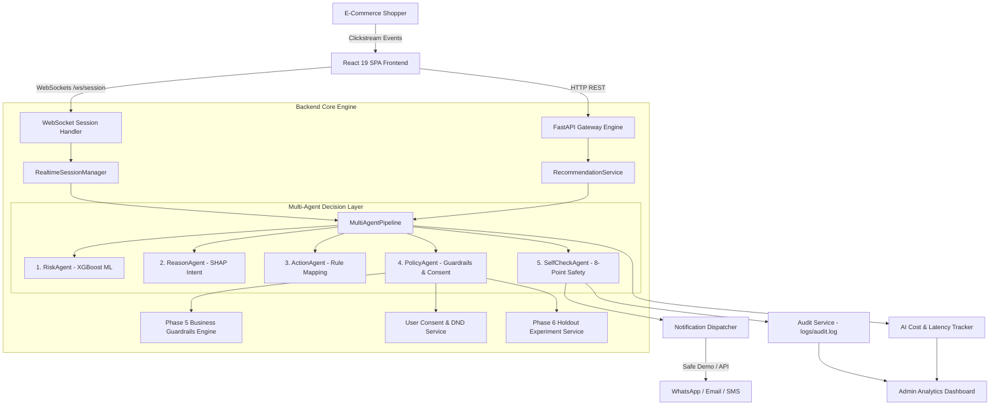
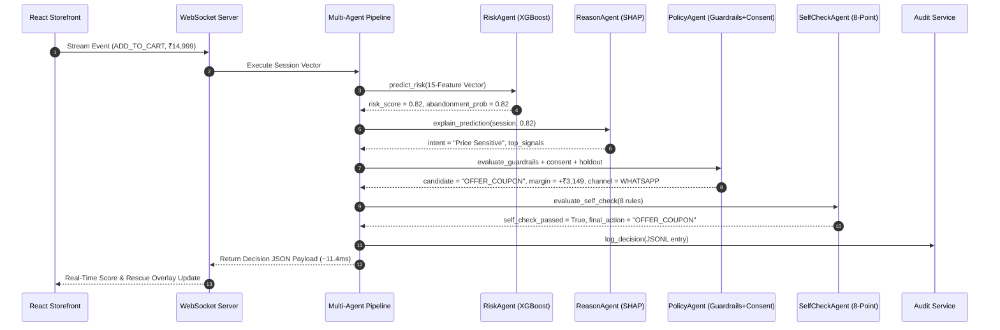
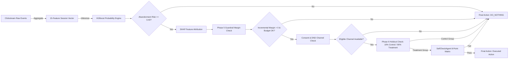
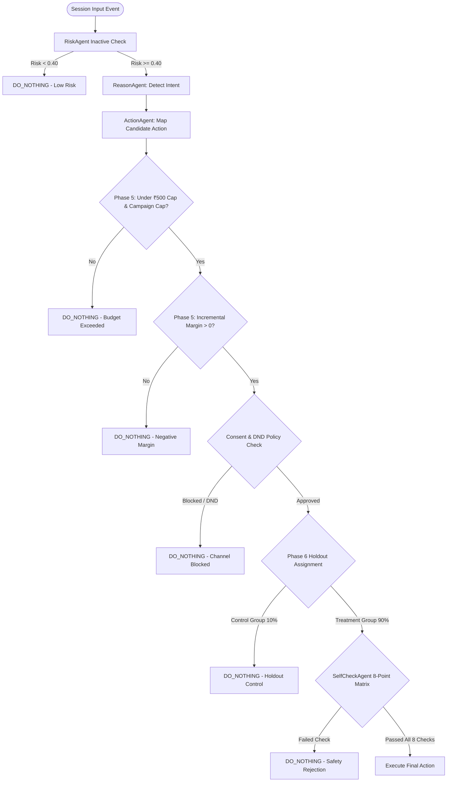

# CartRescue AI — Technical Architecture & System Design Document

---

## 1. System Architecture Diagram

---

## 2. AI Workflow Diagram

---

## 3. Data Flow Diagram

---

## 4. Decision Flow Diagram

---

## 5. System Component Breakdown

| Component | Class Name | Location | Responsibility |
| :--- | :--- | :--- | :--- |
| **API Gateway** | `FastAPI` | [`main.py`](file:///c:/Users/kalya/OneDrive/Desktop/CartPilot/CartPilot/phase3/app/main.py) | REST API routing, CORS middleware, startup model lifecycle management |
| **WebSocket Handler** | `websocket_session_endpoint` | [`websocket_routes.py`](file:///c:/Users/kalya/OneDrive/Desktop/CartPilot/CartPilot/phase3/app/api/websocket_routes.py) | Full-duplex JSON stream handling on `/ws/session/{session_id}` |
| **Session Manager** | `RealtimeSessionManager` | [`realtime_session.py`](file:///c:/Users/kalya/OneDrive/Desktop/CartPilot/CartPilot/phase3/app/services/realtime_session.py) | In-memory clickstream state tracking & feature vector compilation |
| **Risk Prediction** | `PredictionService` | [`prediction_service.py`](file:///c:/Users/kalya/OneDrive/Desktop/CartPilot/CartPilot/phase3/app/services/prediction_service.py) | Pre-trained XGBoost model loading & 15-feature inference |
| **Explanation Engine**| `ExplanationService` | [`explanation_service.py`](file:///c:/Users/kalya/OneDrive/Desktop/CartPilot/CartPilot/phase3/app/services/explanation_service.py) | SHAP feature importance extraction and human-readable intent mapping |
| **Guardrail Engine** | `BusinessGuardrailsEngine` | [`business_guardrails.py`](file:///c:/Users/kalya/OneDrive/Desktop/CartPilot/CartPilot/phase3/app/services/business_guardrails.py) | Per-user/campaign budget limits & expected incremental profit margin calculation |
| **Consent Engine** | `ConsentService` | [`consent_service.py`](file:///c:/Users/kalya/OneDrive/Desktop/CartPilot/CartPilot/phase3/app/services/consent_service.py) | WhatsApp ➔ Email ➔ SMS channel selection & DND blocking |
| **Holdout Engine** | `ExperimentService` | [`experiment_service.py`](file:///c:/Users/kalya/OneDrive/Desktop/CartPilot/CartPilot/phase3/app/services/experiment_service.py) | 10% Control / 90% Treatment reproducible holdout assignment (`random_state=42`) |
| **Safety Agent** | `SelfCheckAgent` | [`self_check_agent.py`](file:///c:/Users/kalya/OneDrive/Desktop/CartPilot/CartPilot/phase3/app/services/self_check_agent.py) | 8-point deterministic safety verification & fallback enforcement |
| **Cost Tracker** | `AICostTracker` | [`ai_cost_tracker.py`](file:///c:/Users/kalya/OneDrive/Desktop/CartPilot/CartPilot/phase3/app/services/ai_cost_tracker.py) | Tracks decision latency, micro-cost ($0.0001), and zero-LLM decision ratio |
| **Audit Log Service** | `AuditService` | [`audit_service.py`](file:///c:/Users/kalya/OneDrive/Desktop/CartPilot/CartPilot/phase3/app/services/audit_service.py) | Appends decision records to JSONL file `logs/audit.log` |

---

## 6. Business Guardrail & Margin Logic

Phase 5 evaluates expected incremental profit before authorizing monetary incentives:

$$\text{Expected Incremental Margin} = (\text{Recovery Prob} \times \text{Cart Value} \times \text{Profit Margin}) - \text{Discount Cost}$$

Where:
- $\text{Recovery Prob} = \text{Risk Score} \times 0.50$
- $\text{Profit Margin} = 30\%$ (configurable in `BusinessConfig`)
- $\text{Discount Cost} = 10\%$ of Cart Value for `OFFER_COUPON`, ₹100 for `OFFER_FREE_SHIPPING`, ₹0 for `SEND_REMINDER`/`RETRY_PAYMENT`/`DO_NOTHING`.

If $\text{Expected Incremental Margin} < 0$, the action is automatically downgraded to **`DO_NOTHING`**.

---

## 7. Holdout Experiment Methodology (Phase 6)

Traffic is assigned to experiment groups using a deterministic hash of the session ID:
- **Control Group (10%)**: Interventions are suppressed (`DO_NOTHING`).
- **Treatment Group (90%)**: Interventions are executed normally.

Key metrics calculated:
- $\text{Control Conversion Rate} = \frac{\text{Control Conversions}}{\text{Control Sessions}}$
- $\text{Treatment Conversion Rate} = \frac{\text{Treatment Conversions}}{\text{Treatment Sessions}}$
- $\text{Incremental Lift} = \text{Treatment Conversion Rate} - \text{Control Conversion Rate}$
- $\text{Incremental Margin} = (\text{Treatment Conversions} \times \text{Avg Cart Value} \times \text{Margin}) - \text{Total Discount Cost} - \text{Control Baseline Revenue}$
